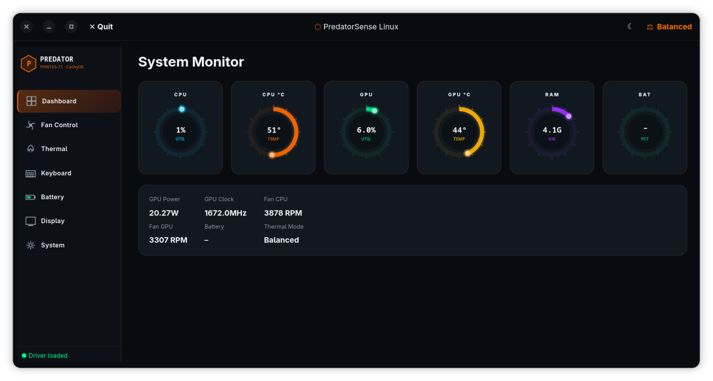
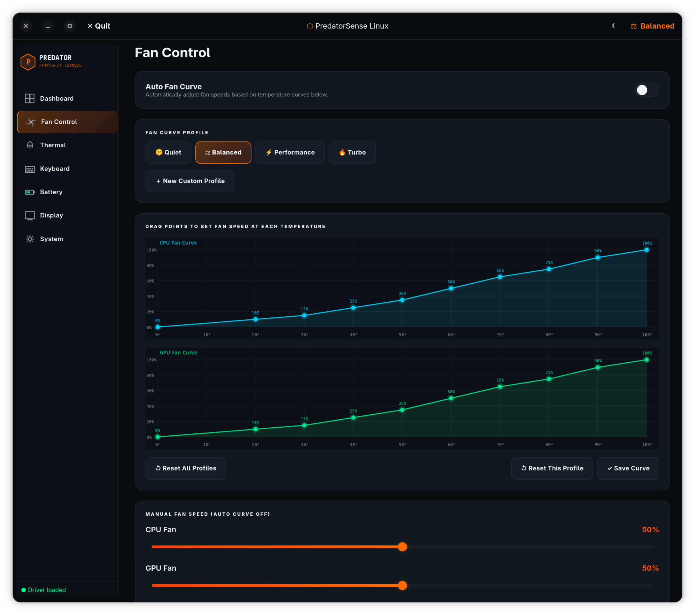
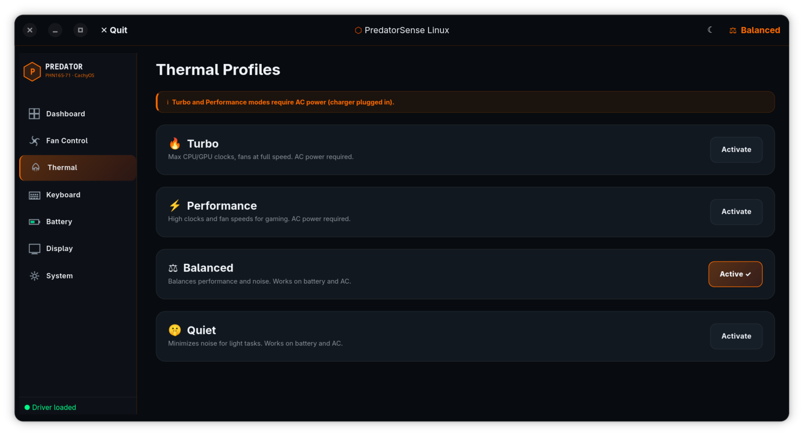
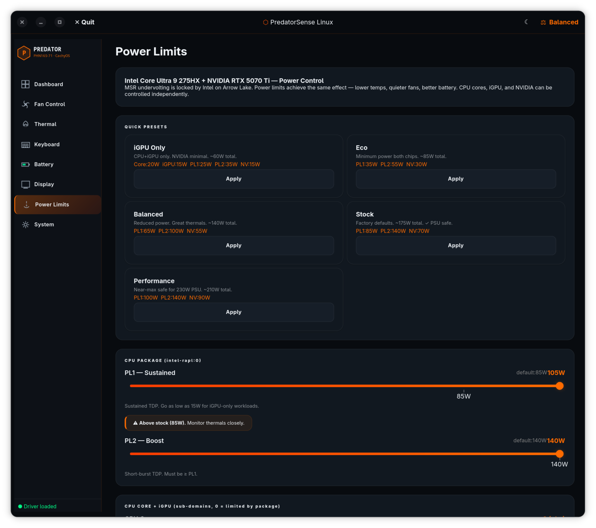
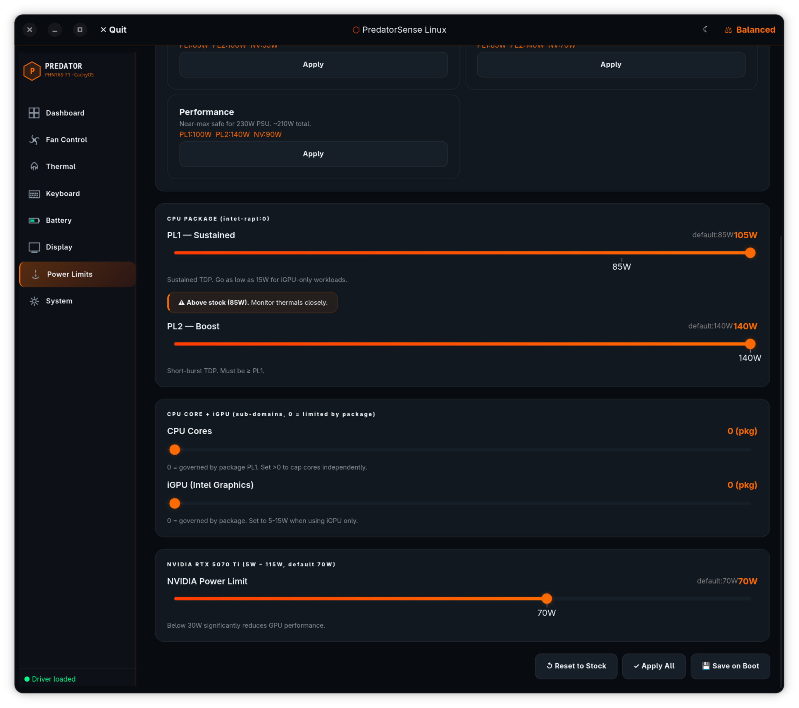
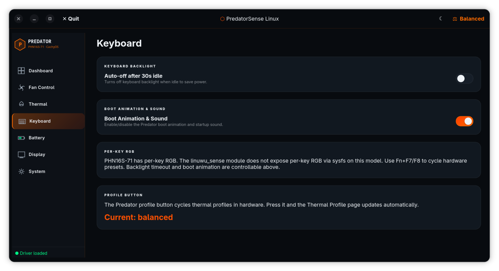
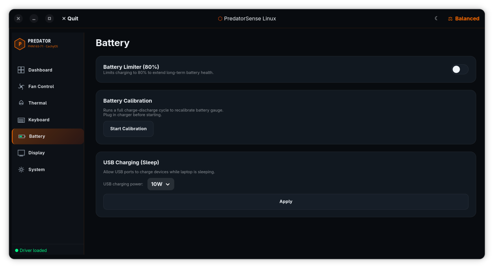
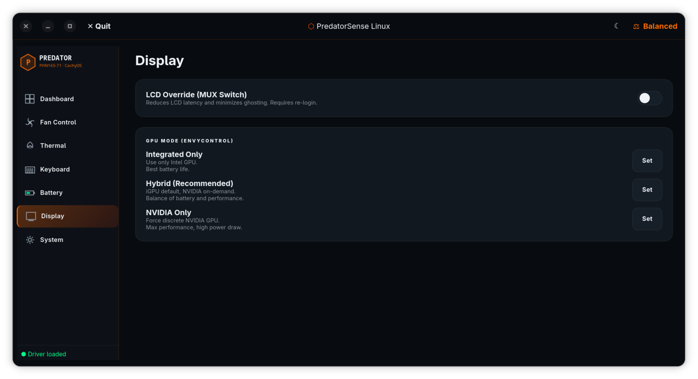
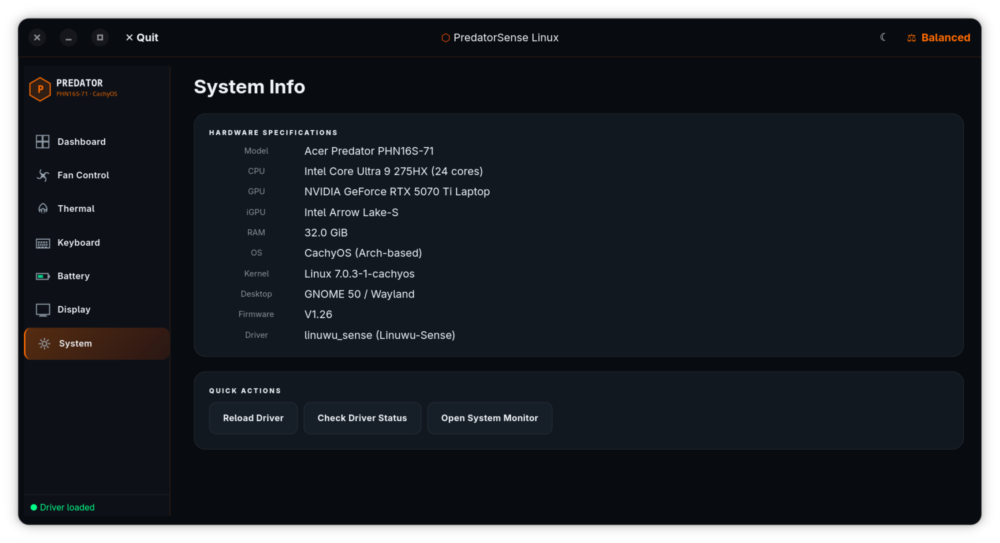

# PredatorSense Linux

<div align="center">

**A full PredatorSense replacement GUI for the Acer Predator PHN16S-71 on Linux**
**Works on GNOME and KDE Plasma**

[](https://www.gnu.org/licenses/old-licenses/gpl-2.0.en.html)
[](https://kernel.org)
[](https://cachyos.org)
[](https://gtk.org)

</div>

---

## ✨ Features

| Feature | Status |
|---|---|
| 📊 Live system monitoring (CPU, GPU, RAM, Battery) | ✅ |
| 🌀 Fan speed control (CPU + GPU independent) | ✅ |
| 🔥 Thermal profiles (Quiet / Balanced / Performance / Turbo) | ✅ |
| ⌨️ Keyboard backlight timeout & boot animation toggle | ✅ |
| 🔋 Battery limiter (80% charge cap) + calibration | ✅ |
| 🔌 USB sleep charging control | ✅ |
| 🖥️ LCD override (MUX switch) | ✅ |
| 🎮 GPU mode switching (Integrated / Hybrid / NVIDIA) | ✅ |
| ⚡ Quick profile switcher in headerbar | ✅ |
| 🌙 Dark & Light mode toggle | ✅ |
| 🚀 Autostart on login | ✅ |
| ⌨️ Hardware keyboard button to cycle profiles | ✅ |

---

## 🖥️ Requirements

- **Laptop:** Acer Predator PHN16S-71
- **OS:** CachyOS or any Arch-based Linux distro
- **Kernel:** Linux 7.0+ (cachyos kernel recommended)
- **Desktop:** GNOME (Wayland or X11)
- **AUR Helper:** `paru` or `yay` (recommended)

---

## 📸 Screenshots

<table>
  <tr>
    <td align="center" width="50%">
      
      <br><b>📊 Dashboard</b> — Live CPU, GPU, RAM and fan monitoring
    </td>
    <td align="center" width="50%">
      
      <br><b>🌀 Fan Control</b> — 10-point drag curve editor with auto fan mode
    </td>
  </tr>
  <tr>
    <td align="center" width="50%">
      
      <br><b>🔥 Thermal Profiles</b> — Quiet, Balanced, Performance, Turbo
    </td>
    <td align="center" width="50%">
      
      <br><b>⚡ Power Limits</b> — CPU PL1/PL2, iGPU and NVIDIA independent control
    </td>
  </tr>
  <tr>
    <td align="center" width="50%">
      
      <br><b>⚡ Power Limits</b> — Sub-domain and NVIDIA sliders with PSU warnings
    </td>
    <td align="center" width="50%">
      
      <br><b>⌨️ Keyboard</b> — Backlight timeout and boot animation control
    </td>
  </tr>
  <tr>
    <td align="center" width="50%">
      
      <br><b>🔋 Battery</b> — 80% limiter, calibration and USB sleep charging
    </td>
    <td align="center" width="50%">
      
      <br><b>🖥️ Display</b> — LCD override and GPU mode switching
    </td>
  </tr>
  <tr>
    <td align="center" width="50%">
      
      <br><b>⚙️ System</b> — Hardware specs and driver management
    </td>
    <td align="center" width="50%"></td>
  </tr>
</table>

---

## ⚡ Quick Install

```bash
git clone https://github.com/djshmoey/predatorsense-linux
cd predatorsense-linux
chmod +x install.sh
./install.sh
```

Reboot and launch:

```bash
predatorsense
```

Or search **"PredatorSense"** in your GNOME app grid.

> **No internet required after cloning.** The `linuwu_sense` kernel driver is bundled locally in the `driver/` folder — the installer uses it directly without downloading anything extra.

> **Works on GNOME and KDE Plasma.** libadwaita is optional — the installer detects your desktop and configures accordingly. No extra setup needed.

---

## 📦 Step-by-Step Installation

### Step 1 — Clone the repository

```bash
git clone https://github.com/djshmoey/predatorsense-linux
cd predatorsense-linux
```

### Step 2 — Run the installer

```bash
chmod +x install.sh
./install.sh
```

The installer automatically:

- Detects your CachyOS kernel variant and installs correct headers
- Builds and installs the **linuwu_sense** kernel module via DKMS
- Sets `predator_v4=Y` module parameter (required for PHN16S-71)
- Blacklists the conflicting `acer_wmi` module
- Installs **EnvyControl** for GPU mode switching
- Configures **lm-sensors** for temperature monitoring
- Sets up `udev` rules and `sudoers` for passwordless hardware control
- Installs the Python GTK4 GUI and creates a desktop launcher

### Step 3 — Make the module parameter permanent

```bash
echo "options linuwu_sense predator_v4=Y" | sudo tee /etc/modprobe.d/linuwu-sense-options.conf
```

### Step 4 — Add yourself to the input group

Required for the profile cycle keyboard button:

```bash
sudo usermod -aG input $USER
```

Log out and back in for this to take effect.

### Step 5 — Add yourself to the input group

```bash
sudo usermod -aG input $USER
```

Required for the Predator Logo Key to cycle profiles.

### Step 6 — Reboot

```bash
sudo reboot
```

### Step 6 — Launch

```bash
predatorsense
```

---

## ⌨️ Profile Cycle Keyboard Button

Press the **Predator Logo Key** to instantly cycle through thermal profiles without opening the app.

The Predator Logo Key is located in the **top-right media cluster, immediately to the left of NumLk**.

> `KEY_PRESENTATION` · code `425` · scancode `0xF5` · device `/dev/input/event2`

**Cycles through:**
```
🤫 Quiet  →  ⚖ Balanced  →  ⚡ Performance  →  🔥 Turbo  →  🔁
```

> **Note:** Performance and Turbo require AC power. Pressing the button while on battery will only cycle between Quiet and Balanced — this matches official Windows PredatorSense behavior.

---

## 🔥 Thermal Profiles

| Profile | Kernel Value | Fan Speed | AC Required |
|---|---|---|---|
| 🤫 Quiet | `low-power` | Minimal / EC managed | No |
| ⚖ Balanced | `balanced` | Auto | No |
| ⚡ Performance | `balanced-performance` | High | **Yes** |
| 🔥 Turbo | `performance` | Maximum | **Yes** |

---

## 🌀 Fan Control

Control CPU and GPU fans independently via sliders (0–100%).

Quick presets:

| Preset | CPU Fan | GPU Fan | Thermal |
|---|---|---|---|
| Turbo | 100% | 100% | Turbo |
| Performance | 80% | 80% | Performance |
| Balanced | 50% | 50% | Balanced |
| Quiet | 0% | 0% | Quiet |

---

## 🎮 GPU Mode Switching

| Mode | Description | Reboot Required |
|---|---|---|
| Integrated | Intel GPU only — best battery life | Yes |
| Hybrid | Intel default, NVIDIA on-demand | Yes |
| NVIDIA Only | Discrete GPU — max performance | Yes |

---

## 🔋 Battery

- **80% Limiter** — Caps charging at 80% to preserve long-term battery health
- **Calibration** — Full charge/discharge cycle to recalibrate battery gauge
- **USB Sleep Charging** — Charge devices while laptop is suspended (5W / 10W / 20W / 45W)

---

## 🔧 Driver Notes

- Uses **linuwu_sense** kernel module from [Linuwu-Sense](https://github.com/0x7375646F/Linuwu-Sense) / [DAMX 0.9.1](https://github.com/Div-Sharp/DAMX)
- DKMS ensures the module rebuilds automatically on kernel updates
- `predator_v4=Y` parameter is required for PHN16S-71 to expose sysfs fan/thermal controls
- The app detects both `predator_sense` and `nitro_sense` sysfs paths automatically

---

## ⚡ Power Limits

> **Note:** True undervolting (MSR) is locked by Intel on Arrow Lake CPUs. Power limits achieve the same real-world effect — lower temps, quieter fans, better battery life.

| Control | Range | Default | Notes |
|---|---|---|---|
| CPU PL1 (sustained) | 15W – 105W | 85W | Go as low as 15W for iGPU-only use |
| CPU PL2 (boost) | 25W – 140W | 140W | Short burst TDP, must be ≥ PL1 |
| CPU Cores sub-domain | 0W – 85W | 0 (pkg) | 0 = governed by package |
| iGPU sub-domain | 0W – 30W | 0 (pkg) | Set 5–15W when NVIDIA is off |
| NVIDIA RTX 5070 Ti | 15W – 100W | 70W | Controlled via nvidia-smi |

**PSU limit: 230W (19.5V × 11.8A).** The app warns you when combined CPU + GPU + ~20W overhead approaches the limit.

### Quick presets

| Preset | CPU PL1 | CPU PL2 | NVIDIA | Total | Use case |
|---|---|---|---|---|---|
| iGPU Only | 25W | 35W | 15W | ~60W | Battery, silent |
| Eco | 35W | 55W | 30W | ~85W | Light work |
| Balanced | 65W | 100W | 55W | ~140W | Everyday use |
| Stock | 85W | 140W | 70W | ~175W | Factory defaults |
| Performance | 100W | 140W | 90W | ~210W | Gaming, max safe for 230W PSU |

Changes apply instantly. Use **💾 Save on Boot** to persist limits across reboots via a systemd service.

---

## 🖥️ KDE Plasma Support

PredatorSense Linux works on both GNOME and KDE Plasma.

- **libadwaita is optional** — the app automatically falls back to GTK4 on KDE
- The installer detects your desktop and skips libadwaita on KDE

### Predator Key on KDE

KDE requires your user to be in the `input` group for the Predator logo key to cycle profiles:

```bash
sudo usermod -aG input $USER
sudo reboot
```

After rebooting, the Predator key will cycle profiles just like on GNOME.

Alternatively you can set up a KDE Global Shortcut to trigger it via D-Bus:

1. **System Settings → Shortcuts → Custom Shortcuts**
2. New → Global Shortcut → Command/URL
3. Set trigger to the Predator Logo Key
4. Set action to:
```bash
gdbus call --session --dest org.predatorsense.linux --object-path /org/predatorsense/linux --method org.gtk.Actions.Activate cycle-profile [] {}
```

---

## 🔜 Coming Soon

These features are planned and actively being worked on:

### 🎨 Per-key RGB Control
The ENE KB9012 RGB controller has been identified at `/dev/hidraw4` (vendor `0CF2`, product `5130`). Full per-key RGB control is in development — the protocol is currently being researched. Once complete you'll be able to set colors, effects and brightness per key directly from the app.

### 🖥️ Multi-model Support (PHN16-73 and others)
Support for other Acer Predator and Nitro models via direct hidraw communication is planned. This will allow the app to work without linuwu_sense on models where the driver has issues.

### 🌈 RGB Effect Keybind
Once per-key RGB is working, a configurable keybind to cycle RGB effects will be added.

---

## 🛠️ Troubleshooting

**Driver not found / warning shown:**
```bash
sudo rmmod linuwu_sense
sudo modprobe linuwu_sense predator_v4=Y
ls /sys/module/linuwu_sense/drivers/platform:acer-wmi/acer-wmi/
```

**DKMS build failed:**
```bash
sudo pacman -S linux-cachyos-headers clang llvm
sudo dkms autoinstall
```

**Fan/battery controls not working (permission denied):**
```bash
sudo udevadm control --reload-rules && sudo udevadm trigger
```

**Profile button not cycling:**
```bash
# Make sure you're in the input group
groups | grep input
# If not:
sudo usermod -aG input $USER
# Then log out and back in
```

**GPU mode not applying:**
```bash
sudo envycontrol --switch hybrid
# Then log out and back in
```

---

## 🗑️ Uninstall

```bash
chmod +x uninstall.sh
./uninstall.sh
```

---

## 📄 License

GPL v2 — same license as the Linux kernel.

---

## 📋 Changelog

### v1.4
- KDE Plasma support — libadwaita now optional, falls back to GTK4
- Predator key now works on KDE (requires input group membership)
- Power limits fully working — sudoers updated with powercap paths
- Fixed multi-user support — installer uses current username dynamically
- Fixed Fish shell compatibility in installer (printf instead of heredoc)
- Kernel/header version mismatch detection — warns before DKMS build
- D-Bus action added so KDE global shortcuts can trigger profile cycle
- Added input group setup step to installer

### v1.3
- **Power Limits page** — control CPU PL1/PL2, CPU cores, iGPU and NVIDIA independently
- PSU-aware limits — capped to respect 230W PSU (19.5V × 11.8A)
- 5 power presets — iGPU Only, Eco, Balanced, Stock, Performance
- Live PSU budget warning when combined CPU+GPU exceeds safe threshold
- Save on Boot — systemd service persists limits across reboots
- NVIDIA power limit via nvidia-smi (5W–100W range)

### v1.2
- Custom fan profiles — create, name and delete named curves
- Fan speeds automatically sync when switching thermal profiles
- Delete button on custom profiles with confirmation dialog
- Reset individual or all profiles to defaults

### v1.1
- 10-point interactive fan curve editor per thermal profile
- Independent CPU and GPU fan curves
- Auto Fan Curve mode — fans adjust automatically based on temperature
- Live updates — drag points and fans respond in real time
- Custom profile creation and management

### v1.0
- Initial release
- Full fan, thermal, battery, display, keyboard, GPU mode control
- Predator Logo Key cycles profiles
- Dark/Light mode, autostart, background mode (window close keeps key listener alive)

---

## 🙏 Credits

- [Linuwu-Sense](https://github.com/0x7375646F/Linuwu-Sense) — WMI kernel module base
- [DAMX](https://github.com/Div-Sharp/DAMX) — DAMX 0.9.1 with PHN16S-71 support
- [EnvyControl](https://github.com/bayasdev/envycontrol) — GPU mode switching
- [python-gobject](https://pygobject.gnome.org/) — GTK4 Python bindings
